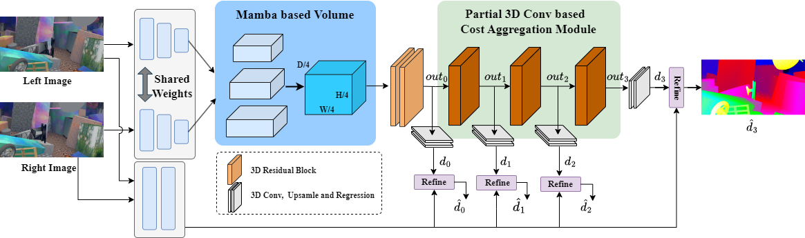

# MambaStereo 
This is the implementation of the paper: "MambaStereo: Enhancing Stereo Matching Accuracy in Ill-Posed Regions via Mamba-Based Cost Volume Construction"

## Introduction

This paper introduces MambaStereo, a novel stereo matching network that leverages the Mamba model to construct a cost volume, enhancing correlation information between long-range pixels in ill-posed regions. To mitigate the limitations of Mamba's local receptive field, we propose a Channel and Local Enhancement Module (CLEM) that integrates contextual information. Additionally, we replace some 3D convolutions in the aggregation network with partial convolutions, reducing computational cost while maintaining accuracy. A disparity refinement scheme based on feature error and dilation convolutions further enhances prediction accuracy. 



# How to use

## Environment
The code is tested on:
* Python 3.9
* Pytorch 2.2.0
* torchvision 0.17.0
* mamba-ssm 2.2.0
* CUDA 12.2
(CUDA should be greater than 11.6)


### Create a virtual environment and activate it.

```
conda create -n name python=3.9
conda activate name
```
### install Dependencies

```
conda install pytorch==2.2.0 torchvision==0.17.0 torchaudio==2.2.0 pytorch-cuda=12.1 -c pytorch -c nvidia
pip install numpy
pip install Pillow
pip install tensorboard
pip install matplotlib 
...
```
### Install Mamba module
```pip install causal-conv1d>=1.4.0```: an efficient implementation of a simple causal Conv1d layer used inside the Mamba block.

```pip install mamba-ssm```: the core Mamba package.

## Data Preparation
Download [Scene Flow Datasets](https://lmb.informatik.uni-freiburg.de/resources/datasets/SceneFlowDatasets.en.html), [KITTI 2012](http://www.cvlibs.net/datasets/kitti/eval_stereo_flow.php?benchmark=stereo), [KITTI 2015](http://www.cvlibs.net/datasets/kitti/eval_scene_flow.php?benchmark=stereo)

## Train
Set a variable for the dataset directory, e.g. DATAPATH="/datasets/sceneflow/". The args are detailed in the paper Then, run train.py as below.
The args in both cases can be set differently depending on the model and datasets.
```
python main.py --datasets sceneflow 
```

## Finetuning on KITTI
Use the following command to train MambaStereo on KITTI2015&2012.

```
python main.py 
```
Use the following command to train MambaStereo on KITTI2015.

```
python main.py 
```
Use the following command to train MambaStereo on KITTI2012.

```
python main.py 
```

## Test
Load the weight and the file path,you can get the output images
```
python prediction.py
```


### Pretrained Model

[Scene Flow](https://drive.google.com/file/d/1uipxPgePS8pjk0F-xW0y4iLDkl8Fv39i/view?usp=drive_link)

## KITTI 2015 finetuning module
[KITTI2012](https://drive.google.com/file/d/1Nzv4XbNq06wH6XNZx05nuLjBKfGneDjk/view?usp=drive_link)

[KITTI2015](https://drive.google.com/file/d/1tIwJyUqSPP2RdWmJoruEcZXcTGhIlI5f/view?usp=drive_link)


# Citation


# Acknowledgements

Our work is inspired by this work and part of codes are migrated from [GwcNet](https://github.com/xy-guo/GwcNet).
